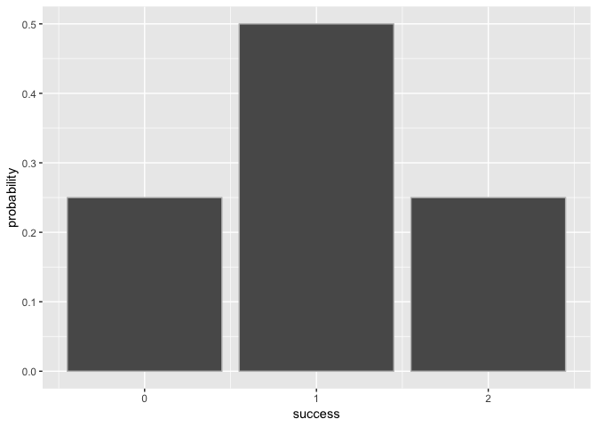
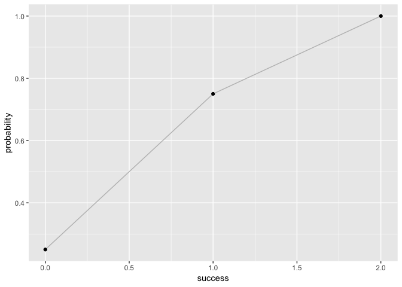

Overview
--------

`"binomial"` is a package for binomial random variable calculations

-   `bin_choose()` computes the number of success given trials.
-   `bin_cumulative()` compute cumulative distribution given trials and
    success probability.
-   `bin_distribution()` compute distribution given trials and success
    probability.
-   `bin_kurtosis()` compute kurtosis given trials and success
    probability.
-   `bin_mean()` compute mean given trials and success probability.
-   `bin_mode()` compute mode given trials and success probability.
-   `bin_probability()` compute probability given sucess, trials and
    success probability.
-   `bin_skewness()` compute skewness given trials and success
    probability.
-   `bin_variable()` show variables of trials and success probability.
-   `bin_variance()` compute variance given trials and success
    probability.
-   `bin_varisummary.binvarable()` show the summary of `bin_variable`
    object.

Motivation
----------

to familiarize myself with R package creation

Installation
------------

    # development version from GitHub:
    #install.packages("devtools") 

    # install "binomial" (without vignettes)
    devtools::install_github("stat133-sp19/hw-stat133-wukesima/binomial")

    # install "binomial" (with vignettes)
    devtools::install_github("stat133-sp19/hw-stat133-wukesima/binomial", build_vignettes = TRUE)
Usage
-----

    bin_choose(3, 2)
    #> [1] 3
    bin_probability(2, 3, 0.5)
    #> [1] 0.375
    bin_distribution(2, 0.5)
    #>   success probability
    #> 1       0        0.25
    #> 2       1        0.50
    #> 3       2        0.25
    plot(bin_distribution(2, 0.5))

    bin_cumulative(2, 0.5)
    #>   success probability cumulative
    #> 1       0        0.25       0.25
    #> 2       1        0.50       0.75
    #> 3       2        0.25       1.00
    plot(bin_cumulative(2, 0.5))

    bin_variable(2, 0.5)
    #> "Binomial variable"
    #> 
    #> Parameters
    #> - number of trials:
    #> - prob of success: 0.5
    summary(bin_variable(2, 0.5))
    #> "Summary Binomial"
    #> 
    #> Parameters
    #> - number of trials:
    #> - prob of success: 0.5
    #> 
    #> Measures
    #> - mean: 
    #> - variance: 
    #> - mode: 
    #> - skewness: 
    #> - kurtosis:
    bin_mean(2, 0.5)
    #> [1] 1
    bin_variance(2, 0.5)
    #> [1] 0.5
    bin_mode(2, 0.5)
    #> [1] 1
    bin_kurtosis(2, 0.5)
    #> [1] -1
    bin_skewness(2, 0.5)
    #> [1] 0
